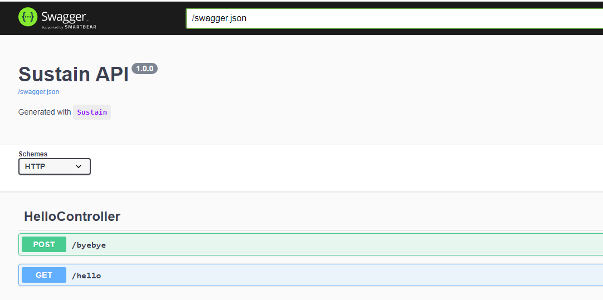
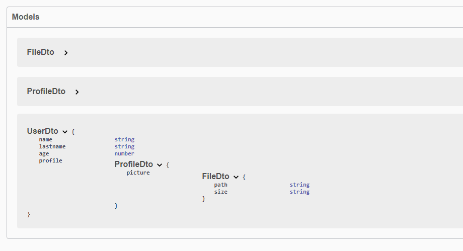
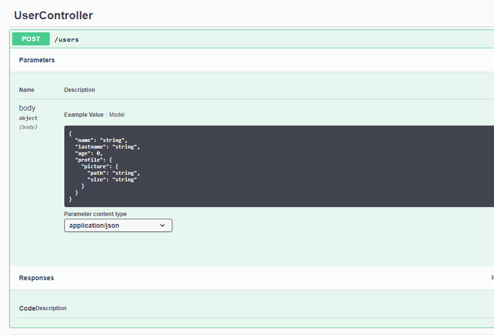
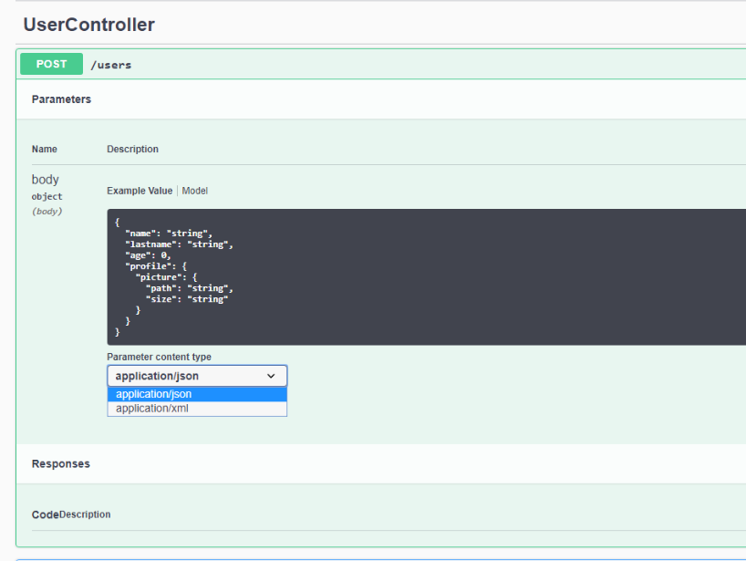

The [OpenAPI](https://swagger.io/) Specification (formerlthy Swagger Specification) is an API description format for REST APIs. 
Sustain provides out-of-the-box a dedicated extension which allows generating the specification by leveraging decorators.

## @SwaggerAPI()

The @SwaggerAPI() helps define the Swagger properties such as the infos (title, description), the schemes (HTTP, HHTPS) ...

## Example
``` typescript
...

@SwaggerAPI({
    info: {
        title: "Sustain API",
        version: "1.0.0",
        description: "Generated with `Sustain`"
    },
    swagger: "2.0",
    schemes: [
        "http"
    ],
})
@App({
    controllers: [
        HelloController,
    ],
    providers: [
        LoggerService,
        UserService,
    ],
    port: process.env.PORT
})

...
```

## Swagger UI
Navigate to http://localhost:5002/swagger-ui to consult the Swagger UI.





## Models

The Swagger extension will automatically populate all the models used in the controllers functions.

In this example we have a UserDto as parameter in the Post create function, as you can see we usethe ``@Body()`` decorator.

```typescript
...
@Controller('/users')
export default class UserController {
    constructor(private userService: UserService) { }
   
    @Post()
    create(@Body() body: UserDto) {
        return body;
    }

    @Get()
    users() {
        return this.userService.list();
    }
...
```

The ``UserDto`` is already catched with the other models with the Swagger extension.

Even the nested Models as ``ProfileDto`` and ``FileDto`` has been added to the models structure.



Now when we navigate to the Swagger-UI we see in the example field of the ``Post`` request the UserDto schema as JSON Object.




## @ApiConsumes, @ApiProduces

Telling Swagger what we expect and what we delever is easy as using theses decorators.

```typescript
...

@Controller('/users')
export default class UserController {
    constructor(private userService: UserService) { }
   
    @ApiConsumes([
        "application/json",
        "application/xml"
    ])
    @ApiProduces([
        "application/json",
        "application/xml"
    ])
    @Post()
    create(@Body() body: UserDto) {
        return body;
    }
...
...
```




And we easely can changes the consume example.


## @ApiResponse

Using this decorator let us define a description for each status that the handler can produces
```typescript
@Controller('/users')
export default class UserController {
    constructor(private userService: UserService) { }
    @ApiResponse([
        { status: 201, description: "Created" }
        { status: 400, description: "Bad request, check your request body" },
    ])
    @Post()
    create(@Body() body: UserDto) {
        return body;
    }
```